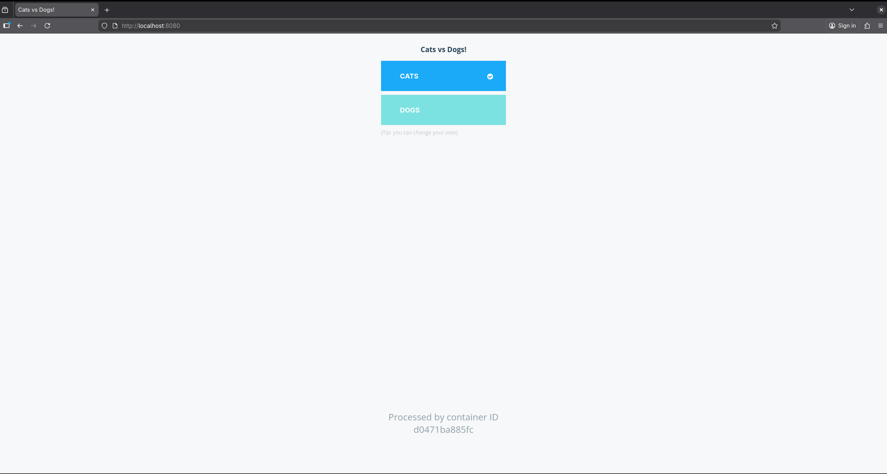
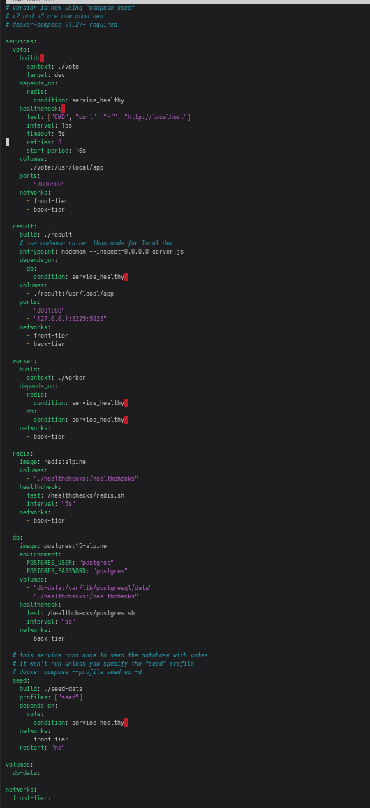

## Step 1: Installing docker engine

To start this lab, I installed the docker engine on my Fedora Linux VM. I did this by following the docker.com documentation here: https://docs.docker.com/engine/install/fedora/

#### Updating fedora

I made sure the fedora version was up to date because docker only works on Fedora versions 41, 42, or 43 as of 2025

1. Updated the current Fedora Linux release
```
sudo dnf upgrade --refresh
```
2. upgraded to most recent release
```
sudo dnf system-upgrade download --releasever=43
```

   
#### Uninstalling old versions of Docker engine

I uninstalled all Docker packages because Linux distributions sometimes come with unofficial Docker packages which may conflict with the official Docker engine I am installing

To remove all docker packages:
```
$ sudo dnf remove docker
$ sudo dnf remove docker-client
$ sudo dnf remove docker-client-latest
$ sudo dnf remove docker-common
$ sudo dnf remove docker-latest
$ sudo dnf remove docker-latest-logrotate
$ sudo dnf remove docker-logrotate
$ sudo dnf remove docker-selinux
$ sudo dnf remove docker-engine-selinux
$ sudo dnf remove docker-engine
```
*Note: You can run this in one command, but I did them separately to make sure each one worked.*

#### Setting up docker repository

I am going to set up the docker repository where I can then download and update docker

1. Installed the `dnf-plugins-core` package to set up the repository
```
sudo dnf -y install dnf-plugins-core
```

2. Added the Docker repository
```
sudo dnf-3 config-manager --add-repo https://download.docker.com/linux/fedora/docker-ce.repo
```

#### Installing the docker engine

1. Installed the latest docker package
```
sudo dnf install docker-ce docker-ce-cli containerd.io docker-buildx-plugin docker-compose-plugin
```

2. Made docker engine start at boot
```
sudo systemctl enable --now docker
```

3. verified the installation was successful by running the `hello-world` image
```
sudo docker run hello-world
```


## Step 2: Setting up an application

For this project, I decided to use the `example-voting-app` (https://github.com/dockersamples/example-voting-app?tab=readme-ov-file) as my application of choice.

1. Cloned the repository
```
git clone https://github.com/dockersamples/example-voting-app.git
```

2. `cd` into the `example-voting-app` directory
```
cd example-voting-app
```

3. built the image using the docker compose command
```
sudo docker compose up
```
This command will build the `example-voting-app` image and start all services in the `docker-compose.yml` file

4.  Checked the vote app by going to `https://localhost:8080` on Firefox
5. Checked the results database by going to`http://localhost:8081` on Firefox

*Vote app*


*results*


`docker-compose.yml` *code block*

