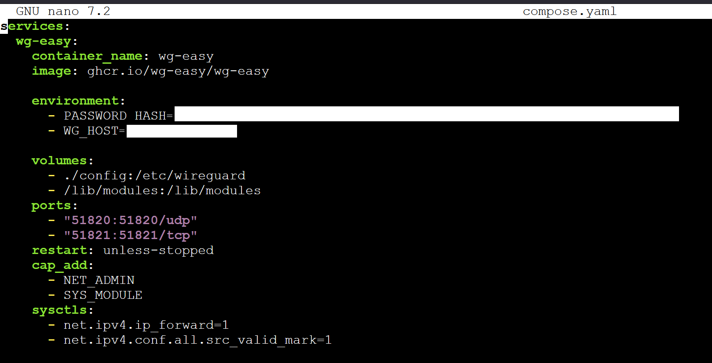
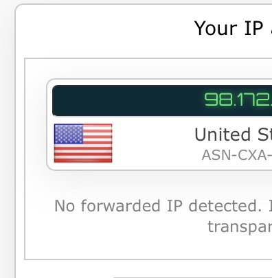
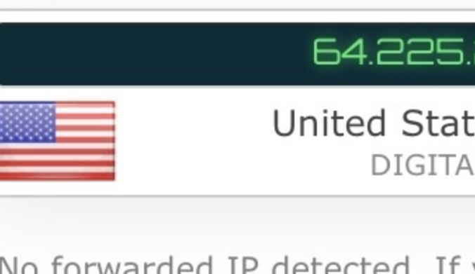

## Step 1: Create a droplet on DigitalOcean

1. Went to DigitalOcean.com and created an account with $200 free credit
2. Created an Ubuntu droplet using the $6/month option
3. Launched the console window provided in the DigitalOcean website

## Step 2: Install docker & docker compose

I followed the guide here: https://docs.docker.com/engine/install/ubuntu/ and used my previous docker compose lab documentation ([[Docker-Compose-Lab-Documentation]]) to complete this step

## Step 3: Install Wireguard

For this step, I followed the `pimylifeup.com` guide here: https://pimylifeup.com/wireguard-docker/


1. Created a directory to store the Wireguard compose file
```
sudo mkdir -p /opt/stacks/wireguard
```

2. Changed into the Wireguard directory
```
cd /opt/stacks/wireguard
```

3. Generated a hash of my password
```
docker run --rm -it ghcr.io/wg-easy/wg-easy wgpw '<PASSWORD>'
```
*replaced `<PASSWORD>` with my password*

4. Wrote down the generated hash of my password to put in my Docker compose file

5. Created and wrote the Docker Compose file
```
sudo nano compose.yaml
```

6. Within this file I wrote...
```
services:
  wg-easy:
    container_name: wg-easy
    image: ghcr.io/wg-easy/wg-easy

    environment:
      - <PASSWORD_HASH>
      - WG_HOST=<IPADDRESS>

    volumes:
      - ./config:/etc/wireguard
      - /lib/modules:/lib/modules
    ports:
      - "51820:51820/udp"
      - "51821:51821/tcp"
    restart: unless-stopped
    cap_add:
      - NET_ADMIN
      - SYS_MODULE
    sysctls:
      - net.ipv4.ip_forward=1
      - net.ipv4.conf.all.src_valid_mark=1
```
- Replaced `<PASSWORD_HASH>` with the password hash generated earlier
- Replaced `<IPADDRESS>` with my droplets public IP
- To find my droplets public IP address use this command
```
curl ifconfig.me
```

*docker-compose.yml file*


7. Got the VPN up and running
```
docker compose up -d
```

8. Went to `http://<IPADDRESS>:51821` to access the WG-easy web interface
9. Logged in using the password I set earlier
10. Created two clients, one for my phone and one for my laptop

#### Phone VPN set up

1. Downloaded Wireguard on the webstore
2. scanned the QR code on WG-Easy
3. Went to IP link before I turned it one and after I turned it on to check if it worked

*Obfuscated phone IP before I turned on VPN*

*Obfuscated phone IP after I turned on VPN*


#### Laptop VPN Setup

1. Download Wireguard
2. download the config file and upload it to the wireguard application
3. activate it


*Obfuscated original IP address on the right and VPN IP address on the left*

